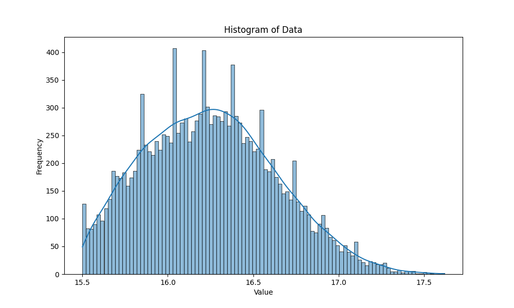

# Onomyoji-Soul-Strenthing
A simple implementation of the logic of Onmyoji soul strengthening process

# Information
This project is about mimic the process of soul strengthening. I record the name,slot,prime attribute, secondary(non-prime) attribute and the value of each attribute. All information is carefully checked to make sure the value range and possibilities are accurate.

# Works
I create a Soul class to record the relevant information of a soul. To initialize a Soul object, I will randomly select a name, a slot, a prime attribute according to the slot and 2-4 non-prime attributes as well as the value for each attribute. The experience needed to level up is also recorded. 

I define a function boost() for strengthening. This function accept two parameters. The first one is a soul object for strengthening, the second one is the amount of experience fed.
For each level up, the prime attribute value will increased. For every three level ups, a randomly selected non-prime attribute will be boosted with a random value.

As Onmyoji players really pay attention to 'Full speed soul(prime attribute is speed and all boosts for non-prime attribute are for speed)', I also conduct a data analysis to analyze how many souls will reach this standard in 50,000,000 rounds using parallel processing.

Also, by running the Soul master file, you will be provided a user interface to generate souls as well as strenthen them.

# Result
From the histogram, we can see that the distribution is similar to a normal distribution, which is quite reasonable. Most full speed soul have a non-prime speed value between 15.77-16.82.

   
   

# Acknowledgement
Thanks to the information of [Onmyoji fandom](https://onmyoji.fandom.com/).
